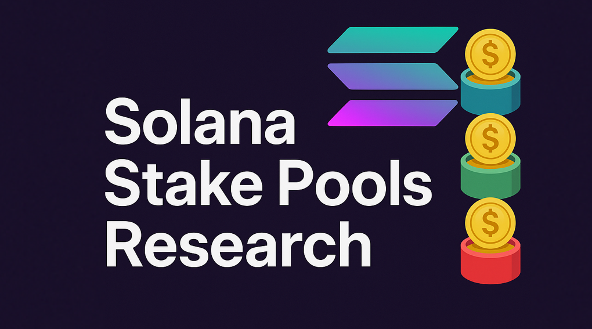

  

# 🔥 Solana Stake Pools Research (2025)

This repository provides a structured and technical overview of major Solana stake pools as of June-July 2025.  
The document is intended for validator operators, contributors, and tooling developers who want to understand delegation criteria, performance benchmarks, and integration points with each pool.

> 🧪 Future updates will include eligibility-checking scripts using public APIs and validator performance scoring tools.

---

## 📚 Table of Contents

- [Notes](#-notes)
  - [1. Jito Stake Pool](#-jito-stake-pool)
  - [2. Shinobi Performance Pool](#-shinobi-performance-pool)
  - [3. Edgevana Liquid Staking](#-edgevana-liquid-staking)
  - [4. JPool Delegation Program](#-jpool-delegation-program)
  - [5. Vault Stake Pool](#-vault-stake-pool)
  - [6. Blazestake](#-blazestake)
  - [7. AeroPool](#-aeropool)
  - [8. DynoSOL](#-dynosol)
  - [9. Jagpool](#-jagpool)
  - [10. Definity Staked SOL](#-definity-staked-sol)
  - [11. Firedancer Delegation Program](#-firedancer-delegation-program)
  - [12. Marinade (PSR)](#-marinade-psr-program)
- [Further Reading & Resources](#-further-reading--resources)
- [My Useful Scripts](#-my-useful-scripts)
- [Disclaimer](#️-disclaimer)

---

## 📘 Notes

- **Recommended Commission** refers to the typical commission level expected by the pool to qualify for delegation.  
  It is not always a hard requirement but reflects what is practically needed to receive stake.
- All data was collected from **publicly available sources** including official documentation, stake pool dashboards, APIs, and Solana community forums.
- This document is for **informational purposes only**. Interacting with any stake pool or program is your own responsibility and should be done after reviewing their official policies and terms. Do your own research (DYOR).

---

## 🧠 Jito Stake Pool

**Website**: [jito.network](https://www.jito.network/stakenet/steward/)  
**Solana Compass Pool Page**: [View](https://solanacompass.com/stake-pools/Jito4APyf642JPZPx3hGc6WWJ8zPKtRbRs4P815Awbb)  
**Discord**: [Join](https://discord.gg/jCcXyerc)  
**Delegation Frequency**: Every epoch ending in `x9`, typically during the last 5–8% of the epoch  
**Recommended Commission**: 0% staking / 10% MEV  
**Blacklist Policy**: Subject to DAO vote  
**Requirements**:
- 5k SOL stake
- Top credit score performance for 30 epochs
- 0% staking / 10% MEV commissions

**APIs**:  
```
https://kobe.mainnet.jito.network/api/v1/validators  
https://kobe.mainnet.jito.network/api/v1/steward_events?limit=100&vote_account=...  
https://kobe.mainnet.jito.network/api/v1/steward_events?limit=10000&event_type=ScoreComponents&epoch=...
```

---

## 🥷 Shinobi Performance Pool

**Website**: [xshin.fi](https://xshin.fi/#Validators)  
**Solana Compass Pool Page**: [View](https://solanacompass.com/stake-pools/spp1mo6shdcrRyqDK2zdurJ8H5uttZE6H6oVjHxN1QN)  
**Discord**: [Join](https://discord.gg/SGggRWJV)  
**Delegation Frequency**: Every epoch, in the last ~20 minutes  
**Recommended Commission**: Unspecified  
**Blacklist Policy**: Manual, maintained by founder (Zantetsu); includes SFDP exclusion but may be appealed directly  
**Requirements**:
- At least 10 epochs in top latency, CU and Consensus Voting performance
- Consistent quality and non-malicious behavior

**APIs**:  
```
https://github.com/1000xsh/xshin-data
```

---

## 💻 Edgevana Liquid Staking

**Website**: [stake.edgevana.com](https://stake.edgevana.com/validators)  
**Solana Compass Pool Page**: [View](https://solanacompass.com/stake-pools/edgejNWAqkePLpi5sHRxT9vHi7u3kSHP9cocABPKiWZ)  
**Discord**: [Join](https://discord.gg/edgevana)  
**Delegation Frequency**: Every epoch  
**Recommended Commission**: 0% staking / 10% MEV  
**Blacklist Policy**: Validators proven to engage in sandwiching or other malicious MEV behavior  
**Requirements**:
- Must be hosted on Edgevana infrastructure
- Average performance over last 10 epochs
- Strategy outlined in [delegation algorithm docs](https://docs.stake.edgevana.com/docs/validators/delegation-strategy-algorithm)

**APIs**:  
```
https://api.stake.edgevana.com/api/v2/scores
```

---

## 📊 JPool Delegation Program

**Website**: [svt.one](https://svt.one/), [jpool.one](https://app.jpool.one/validators)  
**Solana Compass Pool Page**: [View](https://solanacompass.com/stake-pools/CtMyWsrUtAwXWiGr9WjHT5fC3p3fgV8cyGpLTo2LJzG1)  
**Discord**: [Join](https://discord.gg/HAqkz9gC)  
**Delegation Frequency**: Every epoch, 5 epochs scoring cycle  
**Recommended Commission**: 0% staking / 10% MEV (must not increase more than +3%)  
**Blacklist Policy**: suspicious behavior (marked by validators.app)  
**Requirements**:  
- Top 500 APY over the last 10 epochs  
- JPool validator score among top 350  
- Active presence and community contribution  
- Detailed criteria in:  
  - [Inclusion and removal criteria](https://docs.jpool.one/technical-details/smart-strategy/inclusion-and-removal-criteria)  
  - [Validator scoring system](https://docs.jpool.one/technical-details/smart-strategy/validator-scoring-system)  
  - [Extra stake for Community Good validators](https://docs.jpool.one/technical-details/smart-strategy/community-good)  

**APIs**:  
```
https://api.thevalidators.io/jpool-scores/<EPOCH>/<VOTE_ACCOUNT>  
https://api.thevalidators.io/validators-history/history?network=mainnet&vote_id=<VOTE_ACCOUNT>&epoch_count=1000&epoch_from=<EPOCH>  
https://api.thevalidators.io/validators/list?network=mainnet&select=...  
https://api.thevalidators.io/jpool-scores/<EPOCH>  
Testnet History:  
https://api.thevalidators.io/validators-history/history?network=testnet&identity=<TESTNET_IDENTITY>&epoch_count=200
```

---

## 🔒 Vault Stake Pool

**Website**: [thevault.finance](https://thevault.finance/)  
**Solana Compass Pool Page**: [View](https://solanacompass.com/stake-pools/Fu9BYC6tWBo1KMKaP3CFoKfRhqv9akmy3DuYwnCyWiyC)  
**Discord**: [Join](https://discord.gg/aQC53CGgQY) · [Twitter](https://x.com/thevaultfinance)  
**Delegation Frequency**: Every epoch; validators are queued and added in batches  
**Recommended Commission**: 5% staking / 10% MEV  
**Blacklist Policy**: Misbehavior such as sandwiching, ignoring governance (e.g., SIMD votes), or inactivity  
**Requirements**:  
- Proven track record of contribution to the ecosystem  
- Agree to the [SaaS program](https://docs.thevault.finance/validators/stake-as-a-service-saas)  
- Detailed criteria in:  
  - [Application Process](https://docs.thevault.finance/validators/validator-application-process)  
  - [General Delegation Criteria](https://docs.thevault.finance/validators/get-stake-from-the-pool)  
Additional feature: [Kamino Multiply Strategy](https://docs.thevault.finance/validators/kamino-multiply-strategy)  

**APIs**:  
```
https://raw.githubusercontent.com/SolanaVault/stakebot-data/main/bot-stats-latest.txt  
https://raw.githubusercontent.com/SolanaVault/stakebot-data/main/<EPOCH>/<FILENAME_FROM_PREVIOUS_QUERY>  
https://raw.githubusercontent.com/SolanaVault/stake-as-a-service-data/refs/heads/main/<EPOCH>/invoices.json  
```

---

## 🔥 Blazestake

**Website**: [stake.solblaze.org](https://stake.solblaze.org/validators)  
**Solana Compass Pool Page**: [View](https://solanacompass.com/stake-pools/stk9ApL5HeVAwPLr3TLhDXdZS8ptVu7zp6ov8HFDuMi)  
**Discord**: [Join](https://discord.gg/wZNZ3BTG) · [Twitter](https://twitter.com/solblaze_org)  
**Delegation Frequency**: Every epoch  
**Recommended Commission**: 5% staking / 10% MEV, *note: Validators with >50k SOL stake may qualify only with 0% staking / 0% MEV*  
**Blacklist Policy**: Unspecified  
**Requirements**:  
- Highest estimated APY among candidates  
- Technical and social presence encouraged  
- Full criteria in [delegation docs](https://stake-docs.solblaze.org/protocol/delegation-strategy)  
- Optional: direct staking integration on your site ([instructions](https://stake-docs.solblaze.org/developers/integrate))  
Also, to apply you may send an email to `contact@solblaze.org` with the subject: **“Request to Join BlazeStake Pool”**  

**APIs**:  
```
https://stake.solblaze.org/api/v1/validator_set  
https://stake.solblaze.org/api/v1/validator_count  
https://stake.solblaze.org/api/v1/apy  
https://stake.solblaze.org/api/v1/cls_applied_validator_stake?validator=<VOTE_ACCOUNT>  
https://stake.solblaze.org/api/v1/cls_boost?validator=<VOTE_ACCOUNT>
```


---

## 🪁 AeroPool

**Website**: [aeropool.io](https://www.aeropool.io/apply)  
**Solana Compass Pool Page**: [View](https://solanacompass.com/stake-pools/aero2ePURjuEgLKTzcUmF6RypBncBGd7pMUYCoSsVJ6)  
**Twitter**: [@AeroPool_](https://x.com/AeroPool_)  
**Delegation Frequency**: Likely every epoch (unspecified), applications review on a weekly basis  
**Recommended Commission**: 5% staking / 10% MEV  
**Blacklist Policy**: possibly triggered by suspicious behavior  
**Requirements**:
- Must be a Solana ecosystem contributor
- Strategy outlined here: [delegation strategy](https://www.aeropool.io/delegationstrategy)

**APIs**:  
Not available.  
Participant list available at: https://www.aeropool.io/validators

---

## 🦕 DynoSOL

**Website**: [dynosol.io](https://www.dynosol.io) *(need to be verified, DYOR)*  
**Solana Compass Pool Page**: [View](https://solanacompass.com/stake-pools/DpooSqZRL3qCmiq82YyB4zWmLfH3iEqx2gy8f2B6zjru)  
**Twitter**: [@DynoSOL_](https://x.com/DynoSOL_) *(currently suspended)*  
**Delegation Frequency**: Likely every epoch  
**Recommended Commission**: 5% staking / 10% MEV  
**Blacklist Policy**:
- Excessive commission increases
- Sandwiching or harmful MEV practices
- Lack of validator activity

**Requirements**:
- 100+ epochs of consistent activity  
- 99%+ uptime
- UPD: [docs & delegation strategy](https://docs.dynosol.io)  

This new stakepool launched only in epoch 797  
Currently 27 validators with ~500k SOL delegated  

**APIs**:  
Not available.  
Participant list not available on site.  

---

## 🐈‍⬛ Jagpool

**Website**: [jagpool.xyz](https://www.jagpool.xyz/pool)  
**Solana Compass Pool Page**: [View](https://solanacompass.com/stake-pools/jagEdDepWUgexiu4jxojcRWcVKKwFqgZBBuAoGu2BxM)  
**Twitter**: [@JagPool_xyz](https://x.com/JagPool_xyz)  
**Delegation Frequency**: Every 3 epochs scoring cycle  
**Recommended Commission**: 5% staking / 10% MEV  
**Blacklist Policy**:  
- Excessive commission hikes  
- Sandwiching or malicious MEV  
- Long-term online inactivity  

**Requirements**:
- Operate from Latin America (LATAM) region, Singapore or South Africa
- Be active in the region for at least 10 epochs  
- Have SFDP inclusion or 40k+ SOL stake  
- Maintain online presence (website or Twitter)  
- Full criteria:  
  - [Delegation Criteria](https://docs.jagpool.xyz/DELEGATION-STRATEGY/Delegation-Criteria)  
  - [Performance Score](https://docs.jagpool.xyz/DELEGATION-STRATEGY/Performance-Score)  
  - [Application Process](https://docs.jagpool.xyz/DELEGATION-STRATEGY/Validator-Application-Process)  
  - [Community Goods](https://docs.jagpool.xyz/DELEGATION-STRATEGY/Community-Goods)  

**APIs**:  
Not available.  
Validator list viewable at: https://www.jagpool.xyz/pool

---

## 🐉 Definity Staked SOL

**Website**: [definity.finance](https://www.definity.finance/validators) *(need to be verified, DYOR)*  
**Solana Compass Pool Page**: [View](https://solanacompass.com/stake-pools/Bvbu55B991evqqhLtKcyTZjzQ4EQzRUwtf9T4CcpMmPL)  
**Twitter**: [@realdefinity](https://x.com/realdefinity)  
**Delegation Frequency**: Every epoch (likely)  
**Recommended Commission**: 5% staking / 10% MEV  
**Blacklist Policy**: malicious validator behavior  
**Requirements**:
- Validator located in Asia-Pacific (APAC) region  
- Goal: build geographic decentralization  
- Strategy: [staking strategy](https://www.definity.finance/staking-strategy)  

**APIs**:  
Not available

---

## 🔥 Firedancer Delegation Program

**Website**: [delegation.firedancer.io](https://delegation.firedancer.io/delegation-program)  
**Solscan Account**: [View Stake Accounts 1](https://solscan.io/account/8fxe1qGoDVLtqe9PAFyV4kR6zryTDyGQYb9AZQVUCvpM#stakeAccounts) |  [View Stake Accounts 2](https://solscan.io/account/AjLzAtJHDVQ4c2WMnSXt94a5BNt4CorH63af2uEmgkyF#stakeAccounts)  
**Delegation Frequency**: Program starts in a few weeks from June 2025; 3-month rotation cycle  
**Recommended Commission**: 5% staking / 10% MEV  
**Blacklist Policy**: Automatic exclusion upon SFDP removal  
**Requirements**:
- Must be an active SFDP validator
- Minimum 50k SOL stake
- Validator must run Firedancer client on mainnet
- Details: [intro article (June 9)](https://delegation.firedancer.io/blog/introducing-the-firedancer-delegation-program)

**APIs**:  
Not available  
Validators who have submitted applications: https://delegation.firedancer.io/validators

---

## 🥩 Marinade (PSR Program)
 
**Website**: [psr.marinade.finance](https://psr.marinade.finance)  
**Solana Compass Pool Page**: [View](https://solanacompass.com/stake-pools/marinade)  
**Discord**: [Join](https://discord.gg/XM5Chpd7)  
**Delegation Frequency**: Every epoch  
**Recommended Commission**: Flexible; any value allowed  
**Blacklist Policy**: Delegation is algorithmic, but DAO can exclude sandwitchers  

**Requirements**:
- Must place a bond and submit a bid  
- Technical guide: [Validator Bonds CLI](https://github.com/marinade-finance/validator-bonds/blob/main/packages/validator-bonds-cli/README.md)  

**APIs**:  
```
https://validators-api.marinade.finance/validators?epochs=10&limit=1000000  
https://validators-api.marinade.finance/validators?epochs=0&limit=10&query_vote_accounts=<VOTE_ACCOUNT>  
https://validators-api.marinade.finance/validators?limit=9999&query_vote_accounts=<VOTE_ACCOUNT>  
https://validators-api.marinade.finance/rewards?epochs=10  
https://validators-api.marinade.finance/reports/staking
```

---

## 🔗 Further Reading & Resources

- [🛡️ SFDP — Solana Foundation Delegation Program](https://solana.org/delegation-program)  
- [📘 Solana Compass — Stake Pools Overview](https://solanacompass.com/stake-pools)  
- [📂 Validators.app Dashboard](https://www.validators.app)  
- [📈 Stakewiz — Validator Scoreboard](https://stakewiz.com)  
- [🔝 Topvalidators Leaderboard](https://topvalidators.app)
- [🔍 Solana Validator Health Metrics](https://solana.thevalidators.io)
- [🔍 Solana Validator Graphana](https://metrics.stakeconomy.com)
- [🥪 Solana Sandwich Finder Reports](https://github.com/FixedLocally/sandwich-finder/tree/master/reports)

---

## 🛠 My Useful Scripts

A collection of custom tools created to support validator operations and stake pool analytics.

### ✅ Active Projects

- 🔍 **[CVK — See Your Stake v3.0](https://github.com/SOFZP/CVK-See-Your-Stake-v3.0)**  
  Display all stake accounts for your validator with aggregation by source, totals by status (active, activating, deactivating), and interactive sorting.

- 🚨 **[Solana Delinquency Alert Bot](https://github.com/SOFZP/Solana-Delinquency-Alert-Bot)**  
  Lightweight Bash bot that tracks validator delinquency and sends instant Telegram alerts. Configurable for any number of validators.

---

### 🧭 Planned & Upcoming

- 🧮 **Stake Pool Eligibility Checker**  
  Tool to evaluate validator eligibility for stake pools such as Jito, Edgevana, Vault, JPool etc — based on public APIs and validator score criteria.

- 📊 **Validator Score Visualizer**  
  Script to fetch and present validator performance metrics from Jito, JPool, Edgevana, Vault, and others in a normalized and visual format.

- 🛠 **Further development of CVK — See Your Stake v3.0**  
  Adding stake history, export options, and more pool identifier logic.

---

### 🌐 Web Interfaces (In Development)

- 💻 **Web version of CVK — See Your Stake**  
  Clean dashboard version of script output for public/validator use.

- 💼 **Web-based Stake Pool Evaluator**  
  Frontend for comparing validator eligibility and scoring across pools.

---

### 🗃 Archived Projects (Legacy)

> These scripts are no longer maintained, but remain public for reference:

- 🪞 [see-your-solana-node-stake](https://github.com/SOFZP/see-your-solana-node-stake)  
- 🪞 [see-your-solana-node-stake-v-2](https://github.com/SOFZP/see-your-solana-node-stake-v-2)  
- 🪞 [show-solana-node-info_v2](https://github.com/SOFZP/show-solana-node-info_v2)  

---

## ⚠️ Disclaimer

**I am currently working on a unified script that automates validator eligibility checks across multiple Solana stake pools using official APIs and on-chain data.**

All data in this document is sourced from **open and public sources** as of June 2025.  
While care has been taken to ensure accuracy, **I am not responsible for changes in delegation policies, pool criteria, or any decisions made by these third-party stake pools**.

Use at your own discretion.

Community feedback and contributions are welcome!

---

## 🧾 Usage & Attribution

The information in this research is provided freely under an open model.  
You are welcome to use, reference, or build upon this material in your own work, whether personal, educational, or professional.

If you find this research helpful and are using it in a **comprehensive way** (e.g. integrating into documentation, validator tooling, or your product), a visible reference or active link back to this repository is kindly appreciated.

> Let’s make validator knowledge transparent and accessible across Solana.


