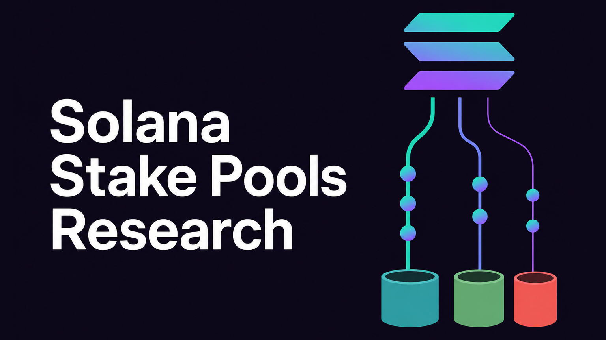

# 🔥 Solana Stake Pools Research (2025-2026)

This repository provides a structured and technical overview of major Solana stake pools and delegation programs as of August 2026. It also includes **live tools and a dashboard** to help validators check their eligibility and performance across these pools.

The detailed notes below cover pools that have a formal, published path for validators to join. The underlying registry tracks 100+ stake groups in total - CEX pools, DEX and DeFi pools, locked stakes, Foundation wallets and more - and all of them are visible on the dashboard.

The research is intended for validator operators, contributors, and tooling developers who want to understand delegation criteria, performance benchmarks, and integration points with each pool.

---

## 🚀 Live Tools & Dashboards

These are the primary tools developed from this research, now available for public use.

* ### 📊 **[Solana Stake Pools Dashboard](https://cryptovik.info/solana-stakepools-dashboard/)**
    The main result of this project. A live, network-wide view of Solana stake flows: per-pool, per-validator, per-epoch granularity since epoch 820, refreshed roughly every 2.5 hours. Every pool section below links straight to its live page.

* ### ⚙️ **[Validator Stake Pools Checker (CLI)](https://github.com/SOFZP/Solana-Stake-Pools-Checker)**
    A command-line script to check a specific validator's Stake Set for various stake pools. Ideal for automated checks and integrations, with support for JSON output.

---

## 📚 Table of Contents

- [Live Tools & Dashboards](#-live-tools--dashboards)
- [Program Status at a Glance](#-program-status-at-a-glance)
- [Data & Resources](#️-data--resources)
- [Notes on Stake Pools](#-notes-on-stake-pools)
  - [1. Jito Stake Pool](#-jito-stake-pool)
  - [2. Shinobi Performance Pool](#-shinobi-performance-pool)
  - [3. Edgevana Liquid Staking](#-edgevana-liquid-staking)
  - [4. JPool Delegation Program](#-jpool-delegation-program)
  - [5. Vault Stake Pool](#-vault-stake-pool)
  - [6. Blazestake](#-blazestake)
  - [7. Phase Delegation (ex-AeroPool)](#-phase-delegation-ex-aeropool)
  - [8. DynoSOL](#-dynosol)
  - [9. Jagpool](#-jagpool)
  - [10. Definity Staked SOL](#-definity-staked-sol)
  - [11. DoubleZero Delegation Program](#-doublezero-delegation-program)
  - [12. Marinade (PSR)](#-marinade-psr-program)
  - [13. Marinade Select](#-marinade-select)
  - [14. SOL Strategies (STKESOL)](#-sol-strategies-stkesol)
  - [15. StarPool](#-starpool)
  - [16. Layer33 (IndieSOL)](#-layer33-indiesol)
- [Dormant and Wound-Down Programs](#-dormant-and-wound-down-programs)
  - [Firedancer Delegation Program](#-firedancer-delegation-program)
  - [SharkPool](#-sharkpool)
- [My Other Validator Scripts](#️-my-other-validator-scripts)
- [Further Reading & Resources](#-further-reading--resources)
- [Disclaimer](#️-disclaimer)
- [Usage & Attribution](#-usage--attribution)

---

## 🚦 Program Status at a Glance

Statuses reflect what is actually observable on-chain (see the dashboard links) as of August 2026, not just what the docs promise.

| Pool | Type | Status | Entry gate | Live data |
|---|---|---|---|---|
| [Jito](#-jito-stake-pool) | Performance | Active | Mandatory BAM, 4-tier ranking | [Dashboard](https://cryptovik.info/solana-stakepools-dashboard/?tab=pools&epoch=latest&sort=category&pool=JITO_POOL) |
| [Shinobi](#-shinobi-performance-pool) | Performance | Active | Top score: latency, skip rate, voting | [Dashboard](https://cryptovik.info/solana-stakepools-dashboard/?tab=pools&epoch=latest&sort=category&pool=SHINOBI_POOL) |
| [Edgevana](#-edgevana-liquid-staking) | Performance | Rules active, pool depleted | Edgevana hosting, V3 ranking | [Dashboard](https://cryptovik.info/solana-stakepools-dashboard/?tab=pools&epoch=latest&sort=category&pool=EDGEVANA) |
| [JPool](#-jpool-delegation-program) | Community | Active | Bond + 3 cohorts (DS / CG / PF) | [Dashboard](https://cryptovik.info/solana-stakepools-dashboard/?tab=pools&epoch=latest&sort=category&pool=JPOOL_POOL) |
| [The Vault](#-vault-stake-pool) | Community | Active | Validator Board approval | [Dashboard](https://cryptovik.info/solana-stakepools-dashboard/?tab=pools&epoch=latest&sort=category&pool=VAULT_POOL) |
| [Blazestake](#-blazestake) | Community | Active | Verified Validators program | [Dashboard](https://cryptovik.info/solana-stakepools-dashboard/?tab=pools&epoch=latest&sort=category&pool=BLAZESTAKE) |
| [Phase](#-phase-delegation-ex-aeropool) | Community | Active | IPS score, quarterly updates | [Dashboard](https://cryptovik.info/solana-stakepools-dashboard/?tab=pools&epoch=latest&sort=category&pool=PHASE_POOL) |
| [DynoSOL](#-dynosol) | Community | Active | Application + track record | [Dashboard](https://cryptovik.info/solana-stakepools-dashboard/?tab=pools&epoch=latest&sort=category&pool=DYNO_POOL) |
| [Jagpool](#-jagpool) | Community | Active | LATAM / SG / ZA regions | [Dashboard](https://cryptovik.info/solana-stakepools-dashboard/?tab=pools&epoch=latest&sort=category&pool=JAG_POOL) |
| [Definity](#-definity-staked-sol) | Community | Active | Operator in focus regions | [Dashboard](https://cryptovik.info/solana-stakepools-dashboard/?tab=pools&epoch=latest&sort=category&pool=DEFIN_POOL) |
| [DoubleZero](#-doublezero-delegation-program) | Delegation program | Active, scaled down | Shred publishing to Edge | [Dashboard](https://cryptovik.info/solana-stakepools-dashboard/?tab=pools&epoch=latest&sort=category&pool=DOUBLEZERO) |
| [Marinade (PSR)](#-marinade-psr-program) | Paid (bonds + bids) | Active | Bond + SAM bid | [Dashboard](https://cryptovik.info/solana-stakepools-dashboard/?tab=pools&epoch=latest&sort=category&pool=MARINADE) |
| [Marinade Select](#-marinade-select) | Institutional | Active | KYB + bond + vetting | [Dashboard](https://cryptovik.info/solana-stakepools-dashboard/?tab=pools&epoch=latest&sort=category&pool=MAR_SELECT) |
| [SOL Strategies](#-sol-strategies-stkesol) | Performance | Active | Algorithmic (Wiz Score) | [Dashboard](https://cryptovik.info/solana-stakepools-dashboard/?tab=pools&epoch=latest&sort=category&pool=STKE_POOL) |
| [StarPool](#-starpool) | Community | Active (small) | Region + size + Jito MEV | [Dashboard](https://cryptovik.info/solana-stakepools-dashboard/?tab=pools&epoch=latest&sort=category&pool=STAR_POOL) |
| [Layer33](#-layer33-indiesol) | Community | Active | Indie coalition membership | [Dashboard](https://cryptovik.info/solana-stakepools-dashboard/?tab=pools&epoch=latest&sort=category&pool=LAYER33_POOL) |
| [Firedancer](#-firedancer-delegation-program) | Delegation program | Wound down | - | [Dashboard](https://cryptovik.info/solana-stakepools-dashboard/?tab=pools&epoch=latest&sort=category&pool=FIREDANCER) |
| [SharkPool](#-sharkpool) | Community | Dormant | U.S. universities | [Dashboard](https://cryptovik.info/solana-stakepools-dashboard/?tab=pools&epoch=latest&sort=category&pool=SHARK_POOL) |

---

## 🗃️ Data & Resources

This repository also serves as a source for curated stake pool data.

* **[Stake Pools Registry (CSV)](https://github.com/SOFZP/Solana-Stake-Pools-Research/blob/main/stakepools_list.csv)**
    The master registry powering the dashboard and the CLI tool. One row per on-chain authority: ```short_name```, ```type```, ```group```, ```category```, ```public_key```, ```long_name```, ```description```, ```url```, ```image```.

* **[On-Chain Stake Data Archive](https://github.com/SOFZP/Solana-Stake-Pools-Research/tree/main/stakepool-data/mainnet-beta)**
    Historical on-chain data showing stake distribution across all validators in the ```mainnet-beta``` cluster. Collected roughly every 2.5 hours, with full epoch-by-epoch snapshots since epoch 820.

---

## 📘 Notes on Stake Pools

-   **Scope**: this document describes pools and programs with formal, published rules that a validator can act on to join. Discretionary stakes (for example the Solana Foundation Incentive wallet) have no such rules and are tracked only on the dashboard.
-   **SFDP** (Solana Foundation Delegation Program) is intentionally not detailed here - it is documented exhaustively at [solana.org/delegation-program](https://solana.org/delegation-program).
-   **Recommended Commission** refers to the typical commission level expected by the pool to qualify for delegation. It is not always a hard requirement but reflects what is practically needed to receive stake.
-   **Status** lines reflect on-chain stake observable on the dashboard as of August 2026. Rules on paper and stake on chain do not always match - both are noted where they differ.
-   All data was collected from **publicly available sources** including official documentation, stake pool dashboards, APIs, and Solana community forums.
-   This document is for **informational purposes only**. Interacting with any stake pool or program is your own responsibility and should be done after reviewing their official policies and terms. Do your own research (DYOR).

---

<!-- pool:JITO_POOL:start -->
## 🧠 Jito Stake Pool

**Status**: Active. Major criteria overhaul in 2026: running BAM is now mandatory.  
**Website**: [jito.network](https://www.jito.network/stakenet/steward/)  
**Docs**: [Delegation criteria](https://www.jito.network/docs/jitosol/jitosol-liquid-staking/stake-pool-operations/delegation-criteria/) | [Steward overview](https://www.jito.network/docs/stakenet/jito-steward/program-overview/) | [Scoring system](https://www.jito.network/docs/stakenet/jito-steward/validators/scoring-system/)  
**Solana Compass Pool Page**: [View](https://solanacompass.com/stake-pools/Jito4APyf642JPZPx3hGc6WWJ8zPKtRbRs4P815Awbb)  
**Dashboard**: [Live stake flows](https://cryptovik.info/solana-stakepools-dashboard/?tab=pools&epoch=latest&sort=category&pool=JITO_POOL)  
**Delegation Frequency**: continuous steward cycles of ~10 epochs; redistribution toward new targets is gradual and takes multiple cycles  
**Recommended Commission**: 0% inflation / lower MEV always ranks higher; in practice up to 5% inflation / 10% MEV currently passes while the BAM validator set is undersubscribed  
**Blacklist Policy**: subject to DAO vote; instant unstaking on commission rugs, heavy delinquency, or blacklisting  
**Requirements**:
- Run **BAM** (Block Assembly Marketplace) - previously an optional bonus, now a hard requirement; target delegations are equal across the selected set, and BAM no longer gives extra stake
- Enter the pool validator set: at least 5 epochs of voting and 5,000 SOL minimum stake
- Pass all binary checks: commission and MEV commission under thresholds, no heavy delinquency, not in the superminority, not blacklisted, correct merkle upload authorities
- Eligible validators are then ranked by a strict 4-tier score: **inflation commission**, then **MEV commission**, then **validator age** (epochs with vote credits), then **vote credits ratio** - a higher tier always dominates lower ones
- The set capacity is around 400 validators; as of August 2026 fewer BAM operators exist than slots, so the effective entry bar is soft and even 5% / 10% commissions receive stake

<details>
<summary><b>APIs</b></summary>

```
https://kobe.mainnet.jito.network/api/v1/validators
https://kobe.mainnet.jito.network/api/v1/steward_events?limit=100&vote_account=...
https://kobe.mainnet.jito.network/api/v1/steward_events?limit=10000&event_type=ScoreComponents&epoch=...
```
</details>
<!-- pool:JITO_POOL:end -->

---

<!-- pool:SHINOBI_POOL:start -->
## 🥷 Shinobi Performance Pool

**Status**: Active.  
**Website**: [xshin.fi](https://xshin.fi/#Validators)  
**Solana Compass Pool Page**: [View](https://solanacompass.com/stake-pools/spp1mo6shdcrRyqDK2zdurJ8H5uttZE6H6oVjHxN1QN)  
**Dashboard**: [Live stake flows](https://cryptovik.info/solana-stakepools-dashboard/?tab=pools&epoch=latest&sort=category&pool=SHINOBI_POOL)  
**Delegation Frequency**: every epoch, in the last ~20 minutes  
**Recommended Commission**: unspecified  
**Blacklist Policy**: manual, maintained by founder (Zantetsu); includes SFDP exclusion but may be appealed directly  
**Requirements**:
- Pool membership goes to the top validators by Shinobi score (54 validators as of August 2026)
- The score is percentile-based and evaluated on 10-epoch averages: for each metric, A = percentile of the value within the pool, B = the metric's weight, and A * B is the contribution to the total score
- Current non-zero weights: **Low Latency Vote** (~0.42), **Skip Rate** (~0.27), **Average Vote Latency** (~0.25), **Consensus Voting** (~0.06)
- Other tracked metrics (Compute Units, Vote Inclusion, prior and subsequent skip rate, city concentration, APY) are shown in the breakdown but currently carry zero weight
- Weights change over time - check the live score breakdown on [xshin.fi](https://xshin.fi/#Validators) for the current formula
- Consistent quality and non-malicious behavior

<details>
<summary><b>APIs</b></summary>

```
https://github.com/1000xsh/xshin-data
```
</details>
<!-- pool:SHINOBI_POOL:end -->

---

<!-- pool:EDGEVANA:start -->
## 💻 Edgevana Liquid Staking

**Status**: Delegation rules (V3) still run, but the pool was almost fully unstaked in 2026. Current pool stake is minimal and it is unclear whether it will be refilled - see the live curve on the dashboard.  
**Website**: [stake.edgevana.com](https://stake.edgevana.com/validators)  
**Docs**: [Delegation strategy algorithm (V3)](https://stake.edgevana.com/docs/validators/delegation-strategy-algorithm)  
**Solana Compass Pool Page**: [View](https://solanacompass.com/stake-pools/edgejNWAqkePLpi5sHRxT9vHi7u3kSHP9cocABPKiWZ)  
**Discord**: [Join](https://discord.gg/edgevana)  
**Dashboard**: [Live stake flows](https://cryptovik.info/solana-stakepools-dashboard/?tab=pools&epoch=latest&sort=category&pool=EDGEVANA)  
**Delegation Frequency**: every epoch  
**Recommended Commission**: up to 5% inflation / 10% MEV at no penalty (averaged over 100 epochs)  
**Blacklist Policy**: validators proven to engage in sandwiching or other malicious MEV behavior  
**Requirements**:
- Must be hosted on Edgevana infrastructure
- **Formula V3** (since epoch 886): 50 delegation slots (down from 60), and a **ranking** system instead of scoring. Eligible validators are ordered by: commission under threshold, MEV commission under threshold, vote credits median percentage (rounded to a whole number, 100-epoch median), **Edgevana Age Tier**, then the unrounded vote credits median
- Age Tier grows with epochs detected active on Edgevana nodes: Tier 1 from 0 epochs, then 50 / 75 / 100 / 200 / 300 / 400 / 500 epochs up to Tier 8
- In practice healthy validators cluster at identical rounded performance and compliant fees, so **Age Tier is the deciding factor** - V3 intentionally prioritizes long-term, continuous operation on Edgevana (confirmed by Edgevana support, January 2026)

<details>
<summary><b>APIs</b></summary>

```
https://api.stake.edgevana.com/api/v2/scores
```
</details>
<!-- pool:EDGEVANA:end -->

---

<!-- pool:JPOOL_POOL:start -->
## 📊 JPool Delegation Program

**Status**: Active. The delegation strategy was overhauled in 2026: mandatory validator bonds, stake buckets, and a community Validator Council.  
**Website**: [jpool.one](https://jpool.one/), [app.jpool.one/validators](https://app.jpool.one/validators)  
**Docs**: [docs.jpool.one](https://docs.jpool.one/) | [Community Good](https://docs.jpool.one/delegation-strategy/community-good)  
**Live slots board**: [app.jpool.one/delegation/slots](https://app.jpool.one/delegation/slots) - who currently holds a delegation seat in each cohort (DS / CG / PF)  
**Solana Compass Pool Page**: [View](https://solanacompass.com/stake-pools/CtMyWsrUtAwXWiGr9WjHT5fC3p3fgV8cyGpLTo2LJzG1)  
**Dashboard**: [Live stake flows](https://cryptovik.info/solana-stakepools-dashboard/?tab=pools&epoch=latest&sort=category&pool=JPOOL_POOL)  
**Delegation Frequency**: removals checked every epoch; additions and full redistribution every 5 epochs; a 1% reserve buffers large withdrawals  
**Recommended Commission**: inflation and MEV commission at or under the threshold (currently 10%); lower fees rank higher within the performance slots  
**Blacklist Policy**: internal and external block lists (including Solana Foundation and Jito Foundation lists); suspicious behavior flags  
**Requirements**:
- **Mandatory on-chain bond** before receiving any delegation. If a validator's yield falls below the Target APY (the mean of the top 30 mid-size validators), the bond pays stakers the difference automatically every epoch. As bond health falls, stake steps down: a grace period below 100%, stake cut by half below 80%, stake capped to the bond's capacity below 50%
- Baseline checks: not blacklisted, not in the superminority, under 750k SOL total stake, published name and logo, commissions under thresholds
- Stake is split into three cohorts: **Direct Stake (DS)** (~45%, a 1:1 match on direct stake up to a 20,000 SOL cap per validator; SFDP participants can receive a second 1:1 match, up to 4x the original delegation), **Community Good (CG)** (30%, distributed proportionally to a CG impact score of 0-9), and a competitive **Performance (PF)** cohort for the rest, filled through a cascade of delegation seats with within-tier ranking

**Validator Council** (announced July 20, 2026): CG applications are now scored by a council of five Solana community members (independent scores, trimmed mean; JPool keeps only a formal admission check and a procedural veto). CG validators move to status updates every 6 months with self-declared KPIs: one missed window halves the CG score, two consecutive misses mean exclusion, and a score cannot drop more than 2 points per review on the merits. The Council's first task is revising the CG criteria, after which all CG validators get a 4-week window to submit updated applications (August-September 2026). Details: [The JPool Validator Council](https://jpool.one/blog/jpool-validator-council).

Note: JPool updated its site and docs in 2026 - older ```docs.jpool.one/technical-details/...``` links may no longer resolve.

<details>
<summary><b>APIs</b></summary>

JPool now runs two documented APIs as a service for the ecosystem - entry point: [Developer Hub](https://jpool.one/developer-hub):

- **JPool API** (public, no key) - validator stake, APY and commission, delegation breakdown (who delegates to a validator), blacklist membership and sources, MEV data, historical network-wide metrics. Docs: [api.jpool.one/docs](https://api.jpool.one/docs/)
- **Solana Validator Toolkit API** (free key issued on request) - per-validator performance and MEV yield, leader and skipped-slot history, operational stats with cluster comparison, epoch data, SOL/JSOL price history. Docs: [api.svt.one/docs](https://api.svt.one/docs)

The legacy ```api.thevalidators.io``` endpoints moved to a new domain and keep working there, for example:

```
https://api.validators.svt.one/jpool-scores/<EPOCH>/<VOTE_ACCOUNT>
https://api.validators.svt.one/validators-history/history?network=mainnet&vote_id=<VOTE_ACCOUNT>&epoch_count=1000&epoch_from=<EPOCH>
https://api.validators.svt.one/validators/list?network=mainnet&select=...
Testnet History:
https://api.validators.svt.one/validators-history/history?network=testnet&identity=<TESTNET_IDENTITY>&epoch_count=200
```

The two documented APIs expose more than these legacy routes - check the Swagger docs for the full surface.
</details>
<!-- pool:JPOOL_POOL:end -->

---

<!-- pool:VAULT_POOL:start -->
## 🔒 Vault Stake Pool

**Status**: Active.  
**Website**: [thevault.finance](https://thevault.finance/) | [Validators page with live ratings](https://thevault.finance/validators)  
**Docs**: [Application process](https://docs.thevault.finance/delegation/validator-application-process) | [Delegation FAQs](https://docs.thevault.finance/delegation/delegation-faqs)  
**Solana Compass Pool Page**: [View](https://solanacompass.com/stake-pools/Fu9BYC6tWBo1KMKaP3CFoKfRhqv9akmy3DuYwnCyWiyC)  
**Twitter**: [x.com/thevaultfinance](https://x.com/thevaultfinance)  
**Dashboard**: [Live stake flows](https://cryptovik.info/solana-stakepools-dashboard/?tab=pools&epoch=latest&sort=category&pool=VAULT_POOL)  
**Delegation Frequency**: every epoch  
**Recommended Commission**: up to 5% inflation / 10% MEV; **0% inflation is required to compete for Elite Performance**  
**Blacklist Policy**: misbehavior such as sandwiching, ignoring governance (e.g. SIMD votes), or inactivity  
**Requirements**:
- Approval by the **Validator Board** (this replaced the old waitlist): the Board votes on ecosystem contributions - apps, tools, infrastructure, open-source work, community activity
- Agree to the Stake-as-a-Service model and keep SaaS invoices current
- Approved validators then receive stake from three sources:
  - **Elite Performance** - currently the largest bucket: the top 50 approved validators by vote credits, with 0% commission
  - **Direct Stake Leaders** - the top 100 validators by their own direct stake through vSOL or Kamino share 40% of the undirected stake equally
  - **Gauges** - locked $V votes on Votex direct an additional share of stake
- Rankings and bucket standings are now visible directly on [thevault.finance/validators](https://thevault.finance/validators)

<details>
<summary><b>APIs</b></summary>

```
https://raw.githubusercontent.com/SolanaVault/stakebot-data/main/bot-stats-latest.txt
https://raw.githubusercontent.com/SolanaVault/stakebot-data/main/<EPOCH>/<FILENAME_FROM_PREVIOUS_QUERY>
https://raw.githubusercontent.com/SolanaVault/stake-as-a-service-data/refs/heads/main/<EPOCH>/invoices.json
```
</details>
<!-- pool:VAULT_POOL:end -->

---

<!-- pool:BLAZESTAKE:start -->
## 🔥 Blazestake

**Status**: Active. The old APY-based algorithmic strategy and email applications are gone - delegation now runs through the Verified Validators program, gauges, and targeted bonuses.  
**Website**: [stake.solblaze.org](https://stake.solblaze.org/validators)  
**Solana Compass Pool Page**: [View](https://solanacompass.com/stake-pools/stk9ApL5HeVAwPLr3TLhDXdZS8ptVu7zp6ov8HFDuMi)  
**Twitter**: [x.com/solblaze_org](https://x.com/solblaze_org)  
**Dashboard**: [Live stake flows](https://cryptovik.info/solana-stakepools-dashboard/?tab=pools&epoch=latest&sort=category&pool=BLAZESTAKE)  
**Delegation Frequency**: every epoch  
**Recommended Commission**: 5% inflation / 10% MEV; 0% commission validators receive roughly double the Verified allocation (3,000+ SOL vs 1,500+ SOL)  
**Blacklist Policy**: sybil operators are filtered out during Verified Validators review  
**Requirements**:
- **SolBlaze Verified Validators** program is the main path: apply with a hot wallet (not your validator keys) at [stake.solblaze.org/verified](https://stake.solblaze.org/verified/); reviews reward non-sybil operators with a track record of unique ecosystem contributions
- **Custom Liquid Staking and BLZE gauges**: stakers and gauge voters can direct extra stake to specific validators; optional [direct staking integration](https://stake-docs.solblaze.org/developers/integrate) on your own site
- **Alpenglow bonus** (May 2026): up to 50k SOL of mainnet stake allocated to Verified Validators who run a node on the Alpenglow community test cluster - own hardware, reasonable uptime, and Alpenglow stake from genesis or from the cluster coordinators. Up to 2,000 SOL bonus to a 0% commission mainnet validator or up to 1,000 SOL with commission, reduced pro-rata if oversubscribed. Apply at [stake.solblaze.org/verified/bonus](https://stake.solblaze.org/verified/bonus), announcement [here](https://x.com/solblaze_org/status/2056848314432455140)

<details>
<summary><b>APIs</b></summary>

```
https://stake.solblaze.org/api/v1/validator_set
https://stake.solblaze.org/api/v1/validator_count
https://stake.solblaze.org/api/v1/apy
https://stake.solblaze.org/api/v1/cls_applied_validator_stake?validator=<VOTE_ACCOUNT>
https://stake.solblaze.org/api/v1/cls_boost?validator=<VOTE_ACCOUNT>
```
</details>
<!-- pool:BLAZESTAKE:end -->

---

<!-- pool:PHASE_POOL:start -->
## 🔩 Phase Delegation (ex-AeroPool)

**Status**: Active. AeroPool was rebranded into **Phase Delegation** - the delegation program of the long-running Phase validator - and its old criteria were replaced with the Index Power Score.  
**Website**: [phase.cc/delegation](https://phase.cc/delegation) | [Participants](https://phase.cc/delegation/validators)  
**Docs**: [What is IPS?](https://phase.cc/delegation/ips)  
**Solana Compass Pool Page**: [View](https://solanacompass.com/stake-pools/aero2ePURjuEgLKTzcUmF6RypBncBGd7pMUYCoSsVJ6)  
**Twitter**: [@phase_](https://x.com/phase_)  
**Dashboard**: [Live stake flows](https://cryptovik.info/solana-stakepools-dashboard/?tab=pools&epoch=latest&sort=category&pool=PHASE_POOL)  
**Delegation Frequency**: unspecified; contribution reviews run quarterly  
**Recommended Commission**: unspecified (allocation is need- and contribution-driven, not fee-driven)  
**Blacklist Policy**: missing two consecutive contribution updates removes the validator from the program  
**Requirements**:
- Validators are evaluated by the **Index Power Score (IPS)**, currently built from four components: **Contributions** (~30%: infrastructure, open-source tooling, education, community work; reviewed quarterly - one missed update zeroes the component until reinstated), **Sustainability** (~30%: the closer a validator's simulated annual profit is to zero, the more stake it receives), **Phase Partner** (~25%: currently, running DoubleZero MultiCast), and **Infrastructure Diversity** (~15%: minority client and low-stake ASN score higher)
- The exact weights and pillars evolve - always check the [IPS page](https://phase.cc/delegation/ips) for the current formula

<details>
<summary><b>APIs</b></summary>

```
https://api.phase.cc/api/validators?is_pdp=true&sort=ips&order=desc&page=1&limit=25
https://api.phase.cc/api/validators/stats
```
</details>
<!-- pool:PHASE_POOL:end -->

---

<!-- pool:DYNO_POOL:start -->
## 🦕 DynoSOL

**Status**: Active.  
**Website**: [dynosol.io](https://www.dynosol.io)  
**Docs**: [docs.dynosol.io](https://docs.dynosol.io)  
**Solana Compass Pool Page**: [View](https://solanacompass.com/stake-pools/DpooSqZRL3qCmiq82YyB4zWmLfH3iEqx2gy8f2B6zjru)  
**Twitter**: [@DynoSOLPool](https://x.com/DynoSOLPool)  
**Dashboard**: [Live stake flows](https://cryptovik.info/solana-stakepools-dashboard/?tab=pools&epoch=latest&sort=category&pool=DYNO_POOL)  
**Delegation Frequency**: likely every epoch  
**Recommended Commission**: 5% inflation / 10% MEV  
**Blacklist Policy**:
- Excessive commission increases
- Sandwiching or harmful MEV practices
- Lack of validator activity

**Requirements**:
- Application via the form on [dynosol.io](https://www.dynosol.io)
- 100+ epochs of consistent activity and 99%+ uptime
- The application optionally accepts **business registration documents** - legally registered operators can qualify for significantly larger allocations
- Launched in epoch 797

**APIs**:  
Not available. Participant list not available on site.
<!-- pool:DYNO_POOL:end -->

---

<!-- pool:JAG_POOL:start -->
## 🐆 Jagpool

**Status**: Active.  
**Website**: [jagpool.xyz](https://www.jagpool.xyz/pool)  
**Solana Compass Pool Page**: [View](https://solanacompass.com/stake-pools/jagEdDepWUgexiu4jxojcRWcVKKwFqgZBBuAoGu2BxM)  
**Twitter**: [@JagPool_xyz](https://x.com/JagPool_xyz)  
**Dashboard**: [Live stake flows](https://cryptovik.info/solana-stakepools-dashboard/?tab=pools&epoch=latest&sort=category&pool=JAG_POOL)  
**Delegation Frequency**: every 3 epochs scoring cycle  
**Recommended Commission**: 5% inflation / 10% MEV  
**Blacklist Policy**:
- Excessive commission hikes
- Sandwiching or malicious MEV
- Long-term online inactivity

**Requirements**:
- Operate from the Latin America (LATAM) region, Singapore or South Africa
- Be active in the region for at least 10 epochs
- Have SFDP inclusion or 40k+ SOL stake
- Maintain online presence (website or Twitter)
- Full criteria:
  - [Delegation Criteria](https://docs.jagpool.xyz/DELEGATION-STRATEGY/Delegation-Criteria)
  - [Performance Score](https://docs.jagpool.xyz/DELEGATION-STRATEGY/Performance-Score)
  - [Application Process](https://docs.jagpool.xyz/DELEGATION-STRATEGY/Validator-Application-Process)
  - [Community Goods](https://docs.jagpool.xyz/DELEGATION-STRATEGY/Community-Goods)

**APIs**:  
Not available. Validator list viewable at: https://www.jagpool.xyz/pool
<!-- pool:JAG_POOL:end -->

---

<!-- pool:DEFIN_POOL:start -->
## 🐉 Definity Staked SOL

**Status**: Active.  
**Website**: [definity.finance/validators](https://www.definity.finance/validators)  
**Solana Compass Pool Page**: [View](https://solanacompass.com/stake-pools/Bvbu55B991evqqhLtKcyTZjzQ4EQzRUwtf9T4CcpMmPL)  
**Twitter**: [@realdefinity](https://x.com/realdefinity)  
**Dashboard**: [Live stake flows](https://cryptovik.info/solana-stakepools-dashboard/?tab=pools&epoch=latest&sort=category&pool=DEFIN_POOL)  
**Delegation Frequency**: every epoch (rebalanced)  
**Recommended Commission**: hard caps - up to 5% inflation and up to 10% MEV (the exact boundary passes, 5.01% or 10.01% rejects)  
**Blacklist Policy**: not published as a separate list; removal from SFDP for cause disqualifies  
**Requirements** (published with sources at [definity.finance/validators](https://www.definity.finance/validators)):
- Hard thresholds: commission and MEV commission under the caps above; actively voting on mainnet (no more than 4 hours offline in any 7-day window); skip rate below 10% across recent epochs; SFDP standing intact; **Jito MEV enabled** (Jito-Solana client participating in the MEV auction)
- **Team based in one of the focus regions**: APAC (East / Southeast / South Asia and Oceania), the Middle East (GCC + Turkey + Israel), Africa, and South America. It is the operator's location that matters - not corporate domicile and not hosting. Hosting location is not an admission gate; it only affects how much stake an admitted validator receives
- Preference above the eligibility bar goes to **verifiable, measurable contributions** in the region: shipped products, dev tooling, hackathons, education and community work - real outputs with public evidence
- Part of the pool fees is reinvested into developer programs, hackathons and early-stage support for teams in the focus regions
- **Direct staking**: validators that bring and maintain their own direct stake through the pool can additionally receive matched delegation on top - see [definity.finance/direct-staking](https://definity.finance/direct-staking)

**GD Index**: the Definity team also builds the [Geographic Decentralisation Index](https://gdindex.app/) - a per-epoch ranking of Solana stake pools by how widely their stake is spread across countries, cities and network operators (ASN), with open methodology and raw JSON data.

**APIs**:  
Not available.
<!-- pool:DEFIN_POOL:end -->

---

<!-- pool:DOUBLEZERO:start -->
## 🌐 DoubleZero Delegation Program

**Status**: Active, but heavily scaled down. The dzSOL pool peaked around **13M SOL** after the mainnet launch (October 2025); by August 2026 it holds around **1-1.5M SOL**. DZDP Phase II, bootstrapped with Solana Foundation support, concluded in June 2026, and that stake is being reallocated by the Foundation to new initiatives; the program continues at a much smaller scale.  
**Website:** [doublezero.xyz](https://doublezero.xyz) | [DZDP program page](https://doublezero.xyz/dzdp)  
**Edge for validators**: [doublezero.xyz/dz-edge/validators](https://doublezero.xyz/dz-edge/validators)  
**dzSOL staking**: [doublezero.xyz/staking](https://doublezero.xyz/staking)  
**Solana Compass Pool Page:** [View](https://solanacompass.com/stake-pools/3fV1sdGeXaNEZj6EPDTpub82pYxcRXwt2oie6jkSzeWi)  
**Discord**: [Join](https://discord.com/invite/doublezerotech)  
**Twitter**: [x.com/doublezero](https://x.com/doublezero)  
**Dashboard**: [Live stake flows](https://cryptovik.info/solana-stakepools-dashboard/?tab=pools&epoch=latest&sort=category&pool=DOUBLEZERO)  
**Network fee**: the initial flat 5% fee on block rewards and priority fees (epochs 859-938) was **removed as of epoch 939** - there is currently no DoubleZero network fee  
**Validator requirements**:
- Connect the validator to **DoubleZero mainnet-beta** and **publish shreds to multicast**. Publishing is not enabled by default, and validators that connect but do not publish shreds are **not eligible for any delegation**
- Since June 30, 2026 delegation is based solely on three criteria: **timely shred publishing** (no lagging), **total SOL stake publishing to Edge**, and **DZDP total staked SOL**

**Edge revenue share** (separate from delegation): validators publishing shreds to DoubleZero Edge earn a share of Edge revenue - accumulating since the Edge launch (April 16, 2026), claimable since June 2026, distributed by the protocol roughly 10 epochs after being earned, with unclaimed allocations expiring after 90 days. The amounts are currently small, but it is direct rev-share for infrastructure work - see [doublezero.xyz/dz-edge/validators](https://doublezero.xyz/dz-edge/validators).

**Useful links**
- Mainnet-beta launch (Oct 2, 2025): https://doublezero.xyz/journal/doublezero-launches-mainnet-beta-a-high-performance-global-network-for-distributed-systems-underpinned-by-2z-token
- Stake pool growth to ~13M SOL: https://doublezero.xyz/journal/doublezero-stake-pool-grows-10m-sol-expanding-total-to-13m-sol
<!-- pool:DOUBLEZERO:end -->

---

<!-- pool:MARINADE:start -->
## 🥩 Marinade (PSR Program)

**Status**: Active.  
**Website**: [psr.marinade.finance](https://psr.marinade.finance)  
**Solana Compass Pool Page**: [View](https://solanacompass.com/stake-pools/marinade)  
**Dashboard**: [Live stake flows](https://cryptovik.info/solana-stakepools-dashboard/?tab=pools&epoch=latest&sort=category&pool=MARINADE)  
**Delegation Frequency**: every epoch  
**Recommended Commission**: flexible; any value allowed - the market decides through bids  
**Blacklist Policy**: delegation is algorithmic, but the DAO can exclude sandwichers  
**Requirements**:
- Place a **bond** (Protected Staking Rewards - the bond compensates stakers for underperformance) and submit a **bid** in the Stake Auction Marketplace (SAM), where validators compete for stake by sharing rewards
- Technical guide: [Validator Bonds CLI](https://github.com/marinade-finance/validator-bonds/blob/main/packages/validator-bonds-cli/README.md)

<details>
<summary><b>APIs</b></summary>

```
https://validators-api.marinade.finance/validators?epochs=10&limit=1000000
https://validators-api.marinade.finance/validators?epochs=0&limit=10&query_vote_accounts=<VOTE_ACCOUNT>
https://validators-api.marinade.finance/validators?limit=9999&query_vote_accounts=<VOTE_ACCOUNT>
https://validators-api.marinade.finance/rewards?epochs=10
https://validators-api.marinade.finance/reports/staking
```
</details>
<!-- pool:MARINADE:end -->

---

<!-- pool:MAR_SELECT:start -->
## 💼 Marinade Select

**Status**: Active.  
**Website**: [marinade.finance/native-staking/marinade-select](https://marinade.finance/native-staking/marinade-select)  
**Docs**: [Marinade Select overview](https://docs.marinade.finance/marinade-protocol/protocol-overview/marinade-select)  
**Stake distribution**: [select.marinade.finance](https://select.marinade.finance)  
**Dashboard**: [Live stake flows](https://cryptovik.info/solana-stakepools-dashboard/?tab=pools&epoch=latest&sort=category&pool=MAR_SELECT)  
**Delegation Frequency**: rebalanced over time to keep allocations consistent across a limited validator set  
**Recommended Commission**: unspecified; selection is compliance- and quality-driven  
**Blacklist Policy**: non-compliance can lead to removal from the set and loss of bond funds  
**Requirements**:
- A curated, institutional-grade validator set built on top of Marinade Native: only **KYB-verified, real-world entities** - no anonymous operators
- Separate vetting process, **KYC**, and a **Select-specific bond** denominated in SOL
- Zero tolerance for malicious MEV; high uptime standards
- Exit requires notifying the Marinade team
- Built for regulated and large-scale stakers; the Canary Marinade Solana ETF (SOLC, launched November 2025) stakes exclusively through Marinade Select

**APIs**:  
Not available. Stake distribution is monitored at [select.marinade.finance](https://select.marinade.finance).
<!-- pool:MAR_SELECT:end -->

---

<!-- pool:STKE_POOL:start -->
## 🟣 SOL Strategies (STKESOL)

**Status**: Active.  
**Website:** [solstrategies.io](https://solstrategies.io)  
**Solana Compass Pool Page:** [View](https://solanacompass.com/stake-pools/StKeDUdSu7jMSnPJ1MPqDnk3RdEwD2QbJaisHMebGhw)  
**Blog Announcement:** [Everything is liquid: SOL Strategies' new liquid staking solution - STKESOL](https://solstrategies.io/blog/everything-is-liquid-sol-strategies-new-liquid-staking-solution-stkesol)  
**Dashboard**: [Live stake flows](https://cryptovik.info/solana-stakepools-dashboard/?tab=pools&epoch=latest&sort=category&pool=STKE_POOL)  
**Delegation Frequency:** not specified (algorithmic delegation using the Stakewiz Wiz Score with a 30-day mean)  
**Recommended Commission:** unspecified (selection is based on a network-health focused score, not solely APY or commission)  
**Blacklist Policy:** not specified  
**Requirements:**
- No application, no KYC, no token purchase required - inclusion is algorithmic
- Delegation is based on the [Stakewiz Wiz Score](https://stakewiz.com/), using a 30-day mean to smooth temporary peaks and troughs
- The score [blends multiple factors](https://stakewiz.com/faq#faq-wizscore): performance, decentralization signals, published validator info, software freshness, avoiding high-concentration locations, and more
- Target is roughly 40-60 validators with near-equal delegation; the set size and weighting may change over time

<details>
<summary><b>APIs</b></summary>

```
https://api.stakewiz.com/validators
https://api.stakewiz.com/validator/<VOTE_ACCOUNT>
https://api.stakewiz.com/wiz_score
```
</details>
<!-- pool:STKE_POOL:end -->

---

<!-- pool:STAR_POOL:start -->
## ✨ StarPool

**Status**: Active. Early-stage, small pool at the beginning of growth.  
**Website**: [starpool.global](https://starpool.global) | [App](https://starpool.global/app) | [Docs](https://starpool.global/docs/) | [Strategy](https://starpool.global/docs/strategy.html)  
**Dashboard**: [Live stake flows](https://cryptovik.info/solana-stakepools-dashboard/?tab=pools&epoch=latest&sort=category&pool=STAR_POOL)  
**Focus**: advance Solana's decentralization by delegating stake to underrepresented validators across Africa, Latin America, Asia, Canada, and beyond  
**Delegation Frequency**: rebalanced every two weeks (following the next Wednesday epoch)  
**Recommended Commission**: validator commission <= 5% over the last 90 days; Jito MEV required  
**Requirements:**
- Outside OFAC-sanctioned countries; not blacklisted by the Solana Foundation
- Total stake in the ~50k-250k SOL range
- Preferably in low stake-concentration regions
<!-- pool:STAR_POOL:end -->

---

<!-- pool:LAYER33_POOL:start -->
## 🎸 Layer33 (IndieSOL)

**Status**: Active.  
**Website**: [layer33.com](https://www.layer33.com/) | [Validators](https://www.layer33.com/#validators) | [Leaderboard](https://www.layer33.com/#leaderboard)  
**Dashboard**: [Live stake flows](https://cryptovik.info/solana-stakepools-dashboard/?tab=pools&epoch=latest&sort=category&pool=LAYER33_POOL)  
**Focus**: a coalition of independent Solana validators (launched around Breakpoint 2025) with the mission of keeping at least **33% of network stake** with independent operators  
**Requirements:**
- Membership in the coalition: independent, value-contributing operators free from institutional or VC funding
- The **IndieSOL** LST distributes stake evenly across member validators
- There are no public algorithmic criteria - joining works through direct contact with the coalition

**APIs**:  
Not available. Member validators and stake distribution at [layer33.com/#validators](https://www.layer33.com/#validators).
<!-- pool:LAYER33_POOL:end -->

---

## 📦 Dormant and Wound-Down Programs

These programs no longer delegate meaningful stake. They are kept here for reference and history - their stake curves are still visible on the dashboard.

<!-- pool:FIREDANCER:start -->
### 🔥 Firedancer Delegation Program

**Status**: Wound down. The program (introduced June 2025: active SFDP validators with 50k+ SOL running the Firedancer client) began withdrawing delegations in October 2025 in the order they were granted, and the delegated stake is now gone. The team noted it may reintroduce targeted delegation windows for major features or high-risk transitions.  
**Website**: [delegation.firedancer.io](https://delegation.firedancer.io/delegation-program)  
**Solscan**: [Stake Accounts 1](https://solscan.io/account/8fxe1qGoDVLtqe9PAFyV4kR6zryTDyGQYb9AZQVUCvpM#stakeAccounts) | [Stake Accounts 2](https://solscan.io/account/AjLzAtJHDVQ4c2WMnSXt94a5BNt4CorH63af2uEmgkyF#stakeAccounts)  
**Dashboard**: [Live stake flows](https://cryptovik.info/solana-stakepools-dashboard/?tab=pools&epoch=latest&sort=category&pool=FIREDANCER)  
**References**:
- Winding down announcement (Sep 20, 2025): https://delegation.firedancer.io/blog/winding-down-delegation-program
- Introducing the program (Jun 9, 2025): https://delegation.firedancer.io/blog/introducing-the-firedancer-delegation-program

Note: the Foundation wallet that seeded the initial Firedancer operators is a separate, discretionary stake (no formal rules) - it is tracked on the dashboard as [Solana Foundation Incentive Stake](https://cryptovik.info/solana-stakepools-dashboard/?tab=pools&epoch=latest&sort=category&pool=SF_INCENTIVE).
<!-- pool:FIREDANCER:end -->

---

<!-- pool:SHARK_POOL:start -->
### 🦈 SharkPool

**Status**: Dormant. The pool's stake was withdrawn in 2026 and it currently delegates almost nothing.  
**Solana Compass Pool Page:** [View](https://solanacompass.com/stake-pools/HQLwnQJFH7t9nBTP4vbdW4eHy62aecfDnj8te8VzqkFL)  
**Dashboard**: [Live stake flows](https://cryptovik.info/solana-stakepools-dashboard/?tab=pools&epoch=latest&sort=category&pool=SHARK_POOL)  
**Focus**: stake allocation to validators run in partnership with U.S. universities (launched with about 20 schools including Princeton and UPenn); SharkLabs funded initial nodes, trained student teams, then transitioned operations to campus groups  
**Notes**: delegation criteria were never fully standardized in public docs  
**Useful links**:
- Program announcement thread: https://x.com/ghostofharvard/status/1940054139192721618
- Coverage: [Blockworks feature on SharkLabs' university validator program](https://blockworks.co/news/solana-teen-brooklyn-manannikov)
<!-- pool:SHARK_POOL:end -->

---

## 🛠️ My Other Validator Scripts

A collection of other custom tools created to support validator operations.

### ✅ Active Projects

-   🔍 **[CVK - See Your Stake v3.0](https://github.com/SOFZP/CVK-See-Your-Stake-v3.0)** Display all stake accounts for your validator with aggregation by source, totals by status (active, activating, deactivating), and interactive sorting.

-   🚨 **[Solana Delinquency Alert Bot](https://github.com/SOFZP/Solana-Delinquency-Alert-Bot)** Lightweight Bash bot that tracks validator delinquency and sends instant Telegram alerts. Configurable for any number of validators.

### 🗃️ Archived Projects (Legacy)

> These scripts are no longer maintained, but remain public for reference:

-   🪞 [see-your-solana-node-stake](https://github.com/SOFZP/see-your-solana-node-stake)
-   🪞 [see-your-solana-node-stake-v-2](https://github.com/SOFZP/see-your-solana-node-stake-v-2)
-   🪞 [show-solana-node-info_v2](https://github.com/SOFZP/show-solana-node-info_v2)

---

## 🔗 Further Reading & Resources

-   [🛡️ SFDP - Solana Foundation Delegation Program](https://solana.org/delegation-program)
-   [⚡ Alpenglow explained: Solana's new consensus, tested from the inside](https://cryptovik.info/news/solana-alpenglow-explained/) - my hands-on write-up from the community test cluster, including the open questions on how Alpenglow will affect pool scoring and validator metrics
-   [🌍 GD Index - Solana Stake Pool Geographic Decentralisation Index](https://gdindex.app/)
-   [📘 Solana Compass - Stake Pools Overview](https://solanacompass.com/stake-pools)
-   [📂 Validators.app Dashboard](https://www.validators.app)
-   [📈 Stakewiz - Validator Scoreboard](https://stakewiz.com)
-   [🔝 Topvalidators Leaderboard](https://topvalidators.app)
-   [🧰 JPool Developer Hub - open Solana validator and network APIs](https://jpool.one/developer-hub)
-   [🔍 Solana Validator Graphana](https://metrics.stakeconomy.com)
-   [🥪 Solana Sandwich Finder Reports](https://github.com/FixedLocally/sandwich-finder/tree/master/reports)

---

## ⚠️ Disclaimer

The tools and data provided in this repository automate validator eligibility checks across multiple Solana stake pools using official APIs and on-chain data.

All data in this document is sourced from **open and public sources** as of August 2026.  
While care has been taken to ensure accuracy, **I am not responsible for changes in delegation policies, pool criteria, or any decisions made by these third-party stake pools**.

Use at your own discretion.

Community feedback and contributions are welcome!

---

## 🧾 Usage & Attribution

The information in this research is provided freely under an open model.  
You are welcome to use, reference, or build upon this material in your own work, whether personal, educational, or professional.

If you find this research helpful and are using it in a **comprehensive way** (e.g. integrating into documentation, validator tooling, or your product), a visible reference or active link back to this repository is kindly appreciated.

> Let's make validator knowledge transparent and accessible across Solana.
